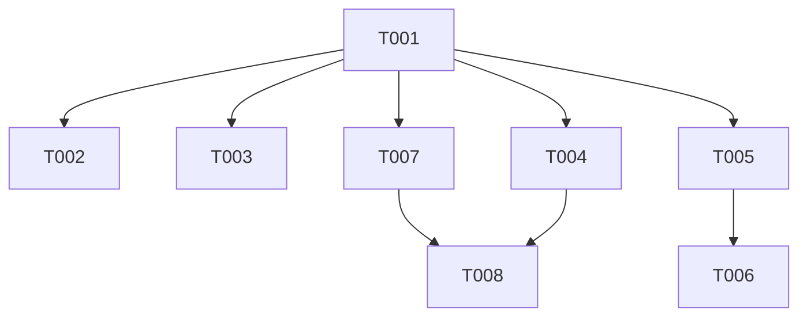

# Plan — foundation

1 EPIC · 4 STORIEs · 8 TASKs · 3 waves. Ids are **frozen**. Later scope
changes append new ids; nothing is renumbered.

## ⚠ Re-scoped 2026-08-09

This plan was approved on 2026-08-03 as `launch-core`: **6 EPICs, 21 STORIEs, 58 TASKs,
13 waves**. It was re-gated under `phases/plan.md` step 7 and failed the shippability
check on both signals — more than one EPIC, and a first wave that shipped nothing you
could deploy and benefit from. That check did not exist when the plan was approved.

EPIC-002 through EPIC-006 are now five named entries in `.sdlc/roadmap.md`, with no ids,
no acceptance criteria and no design. Their STORY and TASK cards are kept and marked
`status: deferred` — the ids are frozen and appear in commit subjects.

**The split needed no resequencing.** No EPIC-001 TASK appears in any wave past 2: waves
3 through 12′ and D contained only TASK-010…058, every one of them in a deferred EPIC. The
wave table below is the old one truncated, not rebuilt, and no dependency edge crossed the
new boundary in the wrong direction.

Everything below this line describes the surviving 8 TASKs. The Global Constraints are
unchanged and still bind — several of them (GC-1, GC-2, GC-6, GC-8) constrain work that
now lives on the roadmap, and they are kept verbatim so that work inherits them intact.

## Global Constraints

Every TASK honours these implicitly. They are the reviewer's attention lens
during Implement. Values are copied verbatim from `refinement.md` and
`config.yaml`.

| # | Constraint | Source |
|---|---|---|
| GC-1 | `p99 ≤ 25 ms server-side on the cache-hit path at 500 RPS` — a **ceiling**, not the target. The target is set from a measured baseline and recorded. | SC-2 |
| GC-2 | Destination edits are reflected on the redirect path **within 5 seconds of the write**, "verified by a test that would still pass with the TTL set to one hour". | SC-3 |
| GC-3 | "Infrastructure stays under $25/month total. This is a real design input, not a preference." Upstash pay-as-you-go; Neon and Vercel free tier. | Constraints |
| GC-4 | "No AI attribution in any commit, changelog, or release note." `git.ai_attribution: false` — HARD false. Juano is sole author of record. | Constraints, config, CLAUDE.md |
| GC-5 | **RLS transaction rule**: tenant scoping via `tenant_id` and a per-request `SELECT set_config('app.tenant_id', $1, true)`. With the third argument `true` the setting is transaction-scoped — every tenant-scoped read or write happens inside a transaction that has set it. **No query path may bypass this.** *(Mechanism corrected 2026-08-05 per F-099; F-007 established that `SET`/`SET LOCAL` accept no bind parameters, so the original wording was not executable. `design/contracts/tenant-context.md` is normative. The constraint itself is unchanged.)* | Constraints |
| GC-6 | "Short-code uniqueness is scoped `(domain_id, slug)`, never global." | Constraints |
| GC-7 | "One backend deployable and one frontend deployable." Next.js + NestJS only. "No Next.js backend, no third service." | Constraints |
| GC-8 | "No unresolvable request returns 5xx to a visitor; it returns the branded 404." | SC-7 |
| GC-9 | Observability: structured logs via pino; no PII in log bodies; click events store `ip_hash`, never raw IP. | config |
| GC-10 | Commits: conventional, branch prefix **`feat/`** (renamed from `sdlc/` on 2026-08-04), subject carries the TASK id — `feat(scope): subject [TASK-001]`. | config |
| GC-11 | "All feature code comes from implementer subagents; the main loop does not write it." | Constraints |
| GC-12 | Human-facing prose (README, DNS-error copy, 404 copy, email bodies) gets a `stop-slop` pass. Machine-facing artifacts do not. | config, CLAUDE.md |
| GC-13 | `docs.required: [README]` — README stays current. Its sole producer is TASK-001. | config |
| GC-14 | "Roughly 25 hours a week, solo." Size a TASK to one focused sitting. | Constraints |
| GC-15 | **No downstream decision may cite a user nobody has interviewed.** Applies to marketing copy. | Problem |

## Dependency graph

**Acyclic: confirmed.** Every edge points strictly from a lower TASK number to a
higher one, so no cycle is possible by construction.

**Every edge is internal.** No surviving TASK depends on a deferred one. The deferred
TASKs depended heavily on these eight — TASK-009 on TASK-005 and TASK-007, TASK-013 on
TASK-005, and so on — which is the direction that makes this a foundation rather than a
slice. Those edges are recorded on the deferred cards and will be re-derived when each
roadmap entry becomes its own initiative.

## Wave table

Waves are computed from `paths` overlap, not intuition. `apps/api/src/app.module.ts`
is a structural serialization point: every TASK registering a NestJS module edits
it. That is a plan-level fact, marked wherever two TASKs in a wave both touch it.

**The adopted sequence pulls the three apex-domain-blocked TASKs into a trailing
wave D.** This costs nothing if a domain is registered early — waves 10 and 11
simply reabsorb them — and removes a three-TASK stall from the critical path if
registration is slow.

| Wave | TASKs | Classification | Note |
|---|---|---|---|
| **0** | 001 | **serial** | Alone by mandate. Also the only backend-owned TASK writing `apps/web/**` — safe precisely because nothing runs beside it. |
| **⛔ GATE** | — | — | **Re-run `/juano-sdlc init`** to populate `testing:` and `quality:` in `config.yaml`. **No dispatch past this line until done.** |
| **1** | 002, 004, 005, 007 | **parallel-safe** | `.github/**`, `apps/web/**`, `apps/api/src/db/**`, `packages/contracts/**` — four disjoint globs, two owner slots, zero overlap. |
| **2** | 003, 006, 008 | **worktree** | 003 writes the composition root. 006 is confined to `apps/api/test/**`; 008 is frontend. **This wave completes the initiative.** |

TASK-009 was the fourth member of wave 2 and left with EPIC-002 on 2026-08-09. It was the
only wave-2 conflict — it and TASK-003 both rewrote `main.ts` and collided on
`app.module.ts:16` — so its departure makes the wave conflict-free. The `worktree`
classification is now precautionary rather than required.

Waves 3 through 12′ and D held only TASK-010…058 and are deleted with the re-scope. The
old table is in git history at `cbaeb79` if the sequencing reasoning is wanted when a
roadmap entry is planned — but it was written before anything shipped, and its assumptions
should be re-derived rather than trusted.

## SC → AC coverage

**This is where the re-scope is most visible, and it should not be softened.** The
initiative's own refinement carries SC-1…SC-8. Seven of the eight are now **entirely
unmapped inside this initiative**, because the TASKs that covered them are on the roadmap.

| SC | Statement | Covered here? | Where it went |
|---|---|---|---|
| SC-1 | Tenant isolation proven, not asserted | **partially** — AC-8, 9, 10, 11, 12 via TASK-005, 006 | The rest (AC-24, 25, 27, 41, 69, 81, 89, 93, 94, 95, 96, 106) needs roadmap items 1–4 |
| SC-2 | Redirect latency committed and enforced | no | roadmap item 2 |
| SC-3 | Cache invalidation correct, not TTL-dependent | no | roadmap item 2 |
| SC-4 | Custom domains provision end to end | no | roadmap item 3 |
| SC-5 | Short codes unique per domain, not globally | no | roadmap item 2 |
| SC-6 | Click events accumulate from day one | no | roadmap item 2 |
| SC-7 | Redirect degrades rather than fails | no | roadmap item 2 |
| SC-8 | Four published posts, each with a real artifact | no | `tech-writing` initiative (Amendment A-3, 2026-08-03) |

**SC-1's partial coverage is the honest headline, and it is weaker than "partial" sounds.**
TASK-006's harness passes over two tables — `tenants` and `rls_fixture_rows`, every table
this repository has — and enumerates ten repository-method surfaces, no routes and no
repositories, because none exist. The suite prints that boundary on every run and writes it
into `report.json`. What this initiative proves is that **the mechanism works**, not that
the system has no uncovered cross-tenant surface.

**What this initiative actually delivers, stated as an outcome rather than as coverage:** a
deployable, CI-gated monorepo, on the internet, whose data layer refuses to answer a query
issued without tenant context, with one shared contracts package and a uniform error
surface. Nothing a user would recognise. That is EPIC-001's stated outcome and it is met on
its own terms — the SC table above measures the *old* 58-TASK scope and is kept so the gap
stays visible rather than being deleted into looking complete.

SC-1..SC-7 are fully mapped. Reverse check passes: every live AC (AC-1..AC-99,
AC-104..AC-107) is claimed by at least one TASK.

**Coverage caveats that travelled to the roadmap with their work:**

- **SC-2's enforcement half is conditional.** AC-63/AC-64 are satisfiable at
  whatever rate Design can make non-flaky. If that is below 500 RPS, SC-2 as
  written is not fully met by the CI gate and its wording must be revisited at a
  gate — not quietly weakened. Carry this into roadmap item 2.
- **SC-4 depends on an unregistered domain.** AC-71 requires one. Until the apex
  domain exists, SC-4 has ACs but no way to execute three of them. Carry this into
  roadmap item 3; it is also noted on `roadmap.md` itself.

## Definition of Ready

Surviving STORIEs only. All four pass.

| Status | STORIEs |
|---|---|
| PASS | 001, 003, 004 |
| PASS with a note | 002 |

STORY-005 through STORY-021 are `status: deferred`. Their DoR verdicts from 2026-08-03 —
including CONDITIONAL on 013 and BLOCKED-on-dispatch on 014 and 015 — are void, not
inherited. Each is re-assessed when its roadmap entry becomes an initiative and gets its
own Refine.

### Amendment 2026-08-04 — TASK-009 split

Kept for the record; **both TASKs it concerns are now deferred.**

Design roughly doubled TASK-009's scope: it acquired the body cap, both IP
rate-limit buckets, the `hooks.before` email bucket, the rate-limit port, a local
limiter, and three integration tests, on top of the Better Auth mount and JWT
issuance. Against GC-14's one-focused-sitting sizing that was the TASK most
likely to overflow, and it sat in wave 2 with most of the initiative behind it.

**TASK-058** took the protection surface and depends on TASK-009. Ids
append and nothing is renumbered — 058..061 were dropped before the Plan gate and
never entered an approved artifact or a commit subject, so 058 was free.

Four ACs were added to STORY-005 (AC-108..AC-111) because no existing AC covered
pre-auth limiting: TASK-051's acceptance is AC-83..AC-86, all tenant-keyed.

## Partial-ship cut lines

**Resolved 2026-08-09: the cut line is this initiative.** The section below was the
2026-08-03 answer to "where could we stop?", and the re-scope answered it by stopping
much earlier than any option it listed. Kept because the reasoning behind the ordering is
what `roadmap.md` inherited.

- **Primary: end of EPIC-003.** A coherent, launchable product — multi-tenant,
  invite-capable, links on the system default domain, a redirect meeting a
  recorded latency commitment, degrading correctly, writing click events. Smaller,
  not unfinished. → **now roadmap items 1 and 2.**
- **Under the adopted sequence, wave 12′ is the better cut.** It leaves everything
  except custom-domain TLS: white-label branding, audit, rate limiting, GDPR, and
  a proven isolation suite all land before wave D.
- **STORY-020 ships regardless of what else is cut**, because SC-1 is a claim the
  portfolio makes. → **still true, and it is why roadmap item 4 carries the isolation
  suite explicitly.**
- **EPIC-004 is not all-or-nothing.** That holds for STORY-015 only; STORY-014 and
  STORY-016 stand on their own.
