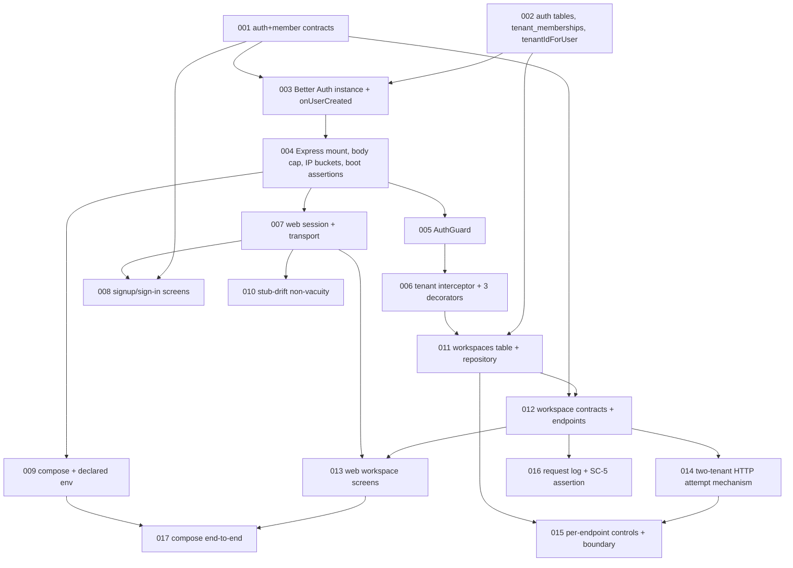

# Plan — identity-membership (roadmap item 1a)

One EPIC, six STORIEs, seventeen TASKs, thirty-six acceptance criteria. Track `full`, forced.

Cards are authoritative; this file is the graph and the constraints. Verified 2026-08-12:
24 cards parse, 36 ACs each claimed by exactly one TASK, no duplicate ids, no empty `paths`,
graph acyclic across 22 edges, both owner slots valid.

## Global Constraints

Project-wide requirements with exact values, copied verbatim from the ADRs, `config.yaml` and
`refinement.md`. Every TASK's requirements implicitly include these, and they are the
reviewer's attention lens during Implement.

**GC-A — a new tenant-scoped table owes three things in one commit.** The `tenant_id` column
via `TENANT_ID_COLUMN_SQL` (`apps/api/src/db/rls.ts:103-104`:
`tenant_id uuid NOT NULL REFERENCES tenants(id) ON DELETE CASCADE`); the output of
`tenantScopedPolicies(table)` (`rls.ts:57-80`) **hand-appended** to the Drizzle-generated
migration, because Drizzle Kit generates no policy DDL (`rls.ts:6-8`); and a
`registerTenantScopedSurfaces()` call in `apps/api/test/isolation/registrations.ts`.
`pnpm db:check-policies` fails on the second, the harness fails the run on the third.
**F-239: `ALTER DEFAULT PRIVILEGES` grants `shortkit_app` full DML on every table the migrator
creates, so table creation and policy-append are not safely separable in time.**

**GC-B — no behavioural choice may key on `NODE_ENV`.** `Dockerfile:83` sets
`ENV NODE_ENV=production` unconditionally in the image `docker compose up` runs (F-386 ruling;
ADR-0040 via F-380 and F-385). Bindings go on declared variables:
`CLIENT_TRUST_BOUNDARY = proxy | direct` (unset reads as `direct`),
`BFF_TRUST_BOUNDARY = bff | direct` (unset reads as `direct`). **The value's validity is
asserted unconditionally in every environment; the requirement is conditional.** `proxy`
requires `TRUSTED_CLIENT_IP_HEADER`; `bff` requires `BFF_PROXY_SECRET`. Any unrecognised value
fails boot everywhere.

**GC-C — the auth mount is one registration in one file (ADR-0013).**
`NestFactory.create(AppModule, { bodyParser: false })`, then
`server.all('/api/auth/{*splat}', authBodyCap({ maxBytes: 32 * 1024 }), authRateLimit(authRateLimitPort), toNodeHandler(auth))`,
then `app.use(express.json({ limit: '100kb' }))` and
`express.urlencoded({ extended: true, limit: '100kb' })`, then
`setGlobalPrefix('api', { exclude: [{ path: 'health', method: RequestMethod.GET }] })`.
Express 5's wildcard is `{*splat}`, not `*`. `authBodyCap` **does not parse**.

**GC-D — the claim set is fixed (ADR-0013).** `jwt` and `bearer` plugins; `expirationTime` 300
seconds; `definePayload` returns `jti: session.id`, `email`, `ev`, `tid` — and **must** return
`jti`, because `dist/plugins/jwt/sign.mjs:49` reads `if (payload.jti)`. Do not write `sub` in
`definePayload`: `sign.mjs:53-61` overwrites it. `jti` is the session id and is **not unique
per token**. `rateLimit: { enabled: false }` — we are the limiter of record. `hooks.before` is
an **array appended to, never replaced**.

**GC-E — the schema is fixed (ADR-0015).** `tenant_memberships` with
`CONSTRAINT tenant_memberships_user_unique UNIQUE (user_id)`;
`user_id text NOT NULL REFERENCES "user"(id) ON DELETE CASCADE` (Better Auth's shape, not this
repo's uuid convention); `TenantRole = owner | admin | member` per amendment A-8, with `member`
at rank 0 granting nothing. Signup creates the tenant via `crypto.randomUUID()` and
`withTenantTransaction`. `databaseHooks.user.after` runs after the user row commits, so
**signup is not atomic**, and an orphaned `user` row with no membership is the **accepted**
failure mode. Do not add a compensating delete. **The workspace-level `memberships` table is
out of scope for this initiative.**

**GC-F — three test tiers.** Unit `*.spec.ts` (`pnpm test`, no Docker, no network);
integration `*.int-spec.ts` (`pnpm test:integration`, `fileParallelism: false`, one shared live
Postgres); isolation under `apps/api/test/isolation/`, inside the same integration run.
**A file missing the exact `.int-spec.ts` suffix silently never runs.** `coverage_gate: null`
by decision, re-justified 2026-08-12. `framework: vitest`.

**GC-G — logging is an allowlist (ADR-0028).** `LOGGABLE_FIELDS` currently holds `attempt`,
`boot_precondition`, `code`, `duration_ms`, `err_message`, `err_name`, `err_stack`, `msg`,
`request_id`, `retry_in_ms`, `route`, `status`, `tenant_id`. Anything unnamed renders
`[redacted]`. **`email` must not be added.** `route` is the route pattern, never a path. There
is exactly one censoring mechanism, deliberately.

**GC-H — third-party network I/O goes in `withTenantTransaction`'s `afterCommit`**, never in
the transaction body (ADR-0002).

**GC-I — track is `full`, forced not chosen.** `force_full_paths` covers
`apps/api/src/auth/**`, `apps/api/src/tenancy/**`, `apps/api/src/db/**`, `apps/api/drizzle/**`,
`apps/api/test/isolation/**` and `packages/contracts/src/auth/**`. This initiative touches all
six.

**GC-J — only two implementer slots exist.** `sdlc-implementer-backend` (`apps/api/**`,
`packages/**`, infra, repo-root config) and `sdlc-implementer-frontend` (`apps/web/**` only).
Naming any other slot fails at dispatch. `git.ai_attribution: false`, hard.

## Tree

**EPIC-001** — Identity, tenancy and membership.

| STORY | Title |
|---|---|
| STORY-001 | Signup creates an account, its tenant and its one membership |
| STORY-002 | An authenticated request is bound to its caller's tenant |
| STORY-003 | An operator signs up and signs in in a browser |
| STORY-004 | An operator creates, renames and archives client workspaces |
| STORY-005 | Cross-tenant isolation is proved per shipped table and endpoint |
| STORY-006 | No credential, session token or email address reaches a log line |

## Dependency graph

Acyclic, 22 edges, no edge to a nonexistent TASK.

## Waves

Parallel-safety computed from `paths` overlap, not intuition.

| Wave | TASKs | Parallel-safe? | Notes |
|---|---|---|---|
| 1 | 001, 002 | yes | `packages/contracts/**` versus `apps/api/src/db/**` + `drizzle/**`. Disjoint. |
| 2 | 003 | — | Writes `auth.config.ts` wholesale; nothing else may touch it. |
| 3 | 004 | — | Sole owner of `main.ts`. GC-C is one registration in one file. |
| 4 | 005, 007, 009 | yes | 005 takes named files under `apps/api/src/auth/`, not `auth/**`, because 003 and 004 own the rest; 007 is `apps/web/**`; 009 is compose, `.env.example`, README. |
| 5 | 006, 008, 010 | yes | 006 `apps/api/src/tenancy/**` + `app.module.ts`; 008 `apps/web/app/(auth)/**`; 010 `.github/scripts/`. 008 and 013 are the adjacent pair, kept apart by route group and by wave. |
| 6 | 011 | — | Second migration; serialised behind 002 on `drizzle/_journal.json` and `schema/index.ts`. |
| 7 | 012 | — | Second edit to `packages/contracts/src/index.ts`; serialised behind 001. |
| 8 | 013, 014, 016 | yes | 013 `apps/web/app/(app)/**`; 014 `test/isolation/{http-attempts,coverage}.ts`; 016 `src/observability/**` + `app.module.ts`. Adjacent in intent, not in files. |
| 9 | 015, 017 | yes | 015 `test/isolation/**`; 017 `scripts/check-compose-stack.sh`. |

Files touched by more than one TASK, all wave-separated: `app.module.ts` (003, 006, 012, 016),
`test/isolation/registrations.ts` (002, 011, 015), `schema/index.ts` and `drizzle/**` (002,
011), `contracts/src/index.ts` (001, 012), `test/isolation/coverage.ts` (014, 015).

## Coverage

| Success criterion | ACs | TASKs |
|---|---|---|
| SC-1 isolation coverage, build fails on an unregistered table | AC-25, AC-26, AC-29, AC-30, AC-31, AC-32 | 011, 014, 015 |
| SC-2 signup, sign-in and workspace creation in a browser on compose | AC-16, AC-17, AC-19, AC-20, AC-27, AC-28 | 007, 008, 009, 013, 017 |
| SC-3 one tenant, one membership, `UNIQUE (user_id)` rejects a second | AC-1, AC-2, AC-4 | 002, 003 |
| SC-4 a second tenant cannot read or write the first's workspaces | AC-29, AC-30, AC-31 | 014, 015 |
| SC-5 no credential, token or email in a log line | AC-33, AC-34, AC-35 | 016 |

Nothing unmapped in either direction. Sixteen ACs trace to the refinement's Scope/In and
Constraints rather than to a success criterion, which is expected: the SCs do not quantify over
the whole scope.

## Path → owner

| Glob | Slot | TASKs |
|---|---|---|
| `packages/contracts/src/{auth,members,workspaces}/**`, `roles.ts`, `index.ts` | `sdlc-implementer-backend` | 001, 012 |
| `apps/api/src/**`, `apps/api/drizzle/**`, `apps/api/test/**`, `apps/api/scripts/**` | `sdlc-implementer-backend` | 002–006, 011, 012, 014, 015, 016 |
| `apps/web/**` | `sdlc-implementer-frontend` | 007, 008, 013 |
| `docker-compose.yml`, `README.md` | `sdlc-implementer-backend` | 009 |
| `.github/scripts/assert-stub-drift.mjs` | `sdlc-implementer-backend` | 010 |
| `scripts/check-compose-stack.sh` | `sdlc-implementer-backend` | 017 |

**`scripts/**` reaches its slot only through `config.yaml`'s `**` fallback** — the same accident
the foundation retro flagged for `observability/**`, where about forty findings routed correctly
by luck. An explicit `{ paths: ["scripts/**"], slot: sdlc-implementer-backend }` entry is owed.

## Reachability

Every file named in a `Produces` block, checked against its own TASK's `paths` globs.
**Unreachable: none.** One repair during the pass: TASK-001 produces implementations of
`asTenantRole` and `tenantRoleRank` in `packages/contracts/src/roles.ts`, which its original
`paths` did not reach; the glob was corrected before the card was finalised.

Three deliverables are named in ACs or STORY bodies and deliberately in no TASK's paths:

- `apps/api/test/support/auth-fixture.ts`, `api-server.ts`, `rls-fixture.ts` belong to
  `sdlc-test-architect` under routing rule 0. TASK-014 and TASK-016 consume them and say so.
- `.github/workflows/ci.yml`: no TASK touches it. The `quality`, `integration` and `compose`
  jobs already run everything this plan adds.
- `apps/web/app/api/bff/[...path]/route.ts` is reachable by TASK-007's
  `apps/web/app/api/bff/**`, and is built only if Design rules the browser goes through the
  proxy.

## Design decisions this plan implies

Listed, not decided. Design owns every one.

1. How `tenantIdForUser` reads `tenant_memberships` at token-mint time, when no tenant context
   is open. `db/client.ts` exports only `databaseTransaction`, against an enumerated caller
   list at `client.ts:11-23`.
2. How Better Auth's `drizzleAdapter` obtains a client under the same constraint.
3. Whether Better Auth's own tables can carry RLS at all, and the exemption list in
   `apps/api/scripts/check-policies.mts` — it names four tables today and the `jwt` plugin adds
   a fifth.
4. How `apps/api/src/db/schema/auth.ts` is obtained. ADR-0013 says CLI-generated, and the CLI
   reads a config TASK-003 writes *after* TASK-002 needs the file.
5. The revocation store binding. ADR-0013 specifies Redis `revoked:jti:<jti>` with a 300-second
   TTL; `redisClient` does not exist and TASK-030 is deferred.
6. Cookie or bearer session, and same-site posture.
7. Whether the browser reaches the API through this app's proxy route or at the API's own
   origin. Decides whether the BFF route is built and which resolver branch supplies the
   rate-limit principal.
8. The archive representation on `workspaces`, and whether an archived workspace is renamable.
9. Whether `workspaces.id` is application-supplied or database-generated. `tenants.id` is
   application-supplied for an ADR-0021 reason that does not apply here.
10. HTTP methods and paths for the four workspace routes.
11. The password policy, or explicit adoption of `better-auth@1.6.26`'s own 8-character floor.
    No artifact in the repository states one.
12. Interceptor ordering, request-log versus tenant-transaction, which decides whether
    `tenant_id` and `duration_ms` are on the line.
13. Whether a user identifier joins `LOGGABLE_FIELDS`, and under what name. A user id is not an
    email address and the two must not be conflated by a field name.
14. How an HTTP cross-tenant attempt distinguishes an isolation refusal from a 404 or 403 that
    proves nothing. This is the scoring rule the harness has been wrong about three times at
    SQL level.
15. Whether to add a browser-driving test tier for SC-2, or accept transport-level measurement.
16. The ADR clause the refinement owes: what 1b adds to `workspaces` and why the existing policy
    set survives it.

## Risks in this breakdown

**Least confident: the TASK-002 / TASK-003 boundary.** They are split so the schema lands before
the config that needs `tenantIdForUser`, but ADR-0013 says `schema/auth.ts` is CLI-generated
*from* a Better Auth config. If Design rules the CLI must run against a live instance, the two
either merge or swap order with a seam, **and that redraws waves 1 and 2 and everything below
them**. The single edit most likely to redraw this plan.

**Endpoint-level isolation attempts are a new attempt category, not a new table.** Foundation's
TASK-006 needed three blockers and five fix rounds to get the SQL-level harness right, and every
one was a statement shape nobody thought of. TASK-014 introduces a new refusal vocabulary where
a 404 can mean three different things. Expect the same class on the endpoints, and expect
TASK-014 to need a second session.

**SC-2's "in a browser" is not measured by a browser.** No tier here drives one. AC-16 through
AC-19 measure the transport a browser uses; AC-28 measures HTTP against the composed stack. A
strict reading of SC-2 needs a browser driver, and STORY-003 grows a TASK.

**The critical path is nine waves and only three parallelise.** Fourteen of seventeen TASKs are
backend. Waves 2, 3, 6 and 7 are single-TASK by necessity — `auth.config.ts`, `main.ts`,
migration ordering, the contracts barrel — not by preference.

**`app.module.ts` is edited by four TASKs across four waves.** Each edit is one line in
`imports` or `providers`, and it is the file most likely to acquire a conflict if a wave slips.

**F-157 stops being theoretical here.** `apps/web/scripts/assert-no-inlined-secrets.mjs` is
structurally blind to dynamic routes, and TASK-007's proxy route is exactly that. The absence of
a finding from that scan is not evidence about TASK-007.
