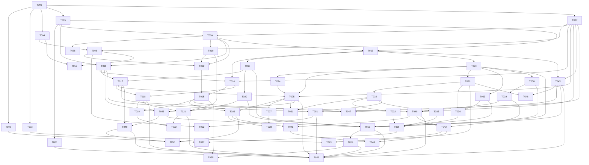

# Plan — launch-core

6 EPICs · 21 STORIEs · 58 TASKs · 13 waves. Ids are **frozen**. Later scope
changes append new ids; nothing is renumbered.

## Global Constraints

Every TASK honours these implicitly. They are the reviewer's attention lens
during Implement. Values are copied verbatim from `refinement.md` and
`config.yaml`.

| # | Constraint | Source |
|---|---|---|
| GC-1 | `p99 ≤ 25 ms server-side on the cache-hit path at 500 RPS` — a **ceiling**, not the target. The target is set from a measured baseline and recorded. | SC-2 |
| GC-2 | Destination edits are reflected on the redirect path **within 5 seconds of the write**, "verified by a test that would still pass with the TTL set to one hour". | SC-3 |
| GC-3 | "Infrastructure stays under $25/month total. This is a real design input, not a preference." Upstash pay-as-you-go; Neon and Vercel free tier. | Constraints |
| GC-4 | "No AI attribution in any commit, changelog, or release note." `git.ai_attribution: false` — HARD false. Juano is sole author of record. | Constraints, config, CLAUDE.md |
| GC-5 | **RLS transaction rule**: tenant scoping via `tenant_id` and a per-request `SET LOCAL app.tenant_id`. `SET LOCAL` is transaction-scoped — every tenant-scoped read or write happens inside a transaction that has set it. **No query path may bypass this.** | Constraints |
| GC-6 | "Short-code uniqueness is scoped `(domain_id, slug)`, never global." | Constraints |
| GC-7 | "One backend deployable and one frontend deployable." Next.js + NestJS only. "No Next.js backend, no third service." | Constraints |
| GC-8 | "No unresolvable request returns 5xx to a visitor; it returns the branded 404." | SC-7 |
| GC-9 | Observability: structured logs via pino; no PII in log bodies; click events store `ip_hash`, never raw IP. | config |
| GC-10 | Commits: conventional, branch prefix **`feat/`** (renamed from `sdlc/` on 2026-08-04), subject carries the TASK id — `feat(scope): subject [TASK-001]`. | config |
| GC-11 | "All feature code comes from implementer subagents; the main loop does not write it." | Constraints |
| GC-12 | Human-facing prose (README, DNS-error copy, 404 copy, email bodies) gets a `stop-slop` pass. Machine-facing artifacts do not. | config, CLAUDE.md |
| GC-13 | `docs.required: [README]` — README stays current. Its sole producer is TASK-001. | config |
| GC-14 | "Roughly 25 hours a week, solo." Size a TASK to one focused sitting. | Constraints |
| GC-15 | **No downstream decision may cite a user nobody has interviewed.** Applies to marketing copy. | Problem |

## Dependency graph

**Acyclic: confirmed.** Every edge points strictly from a lower TASK number to a
higher one, so no cycle is possible by construction.

## Wave table

Waves are computed from `paths` overlap, not intuition. `apps/api/src/app.module.ts`
is a structural serialization point: every TASK registering a NestJS module edits
it. That is a plan-level fact, marked wherever two TASKs in a wave both touch it.

**The adopted sequence pulls the three apex-domain-blocked TASKs into a trailing
wave D.** This costs nothing if a domain is registered early — waves 10 and 11
simply reabsorb them — and removes a three-TASK stall from the critical path if
registration is slow.

| Wave | TASKs | Classification | Note |
|---|---|---|---|
| **0** | 001 | **serial** | Alone by mandate. Also the only backend-owned TASK writing `apps/web/**` — safe precisely because nothing runs beside it. |
| **⛔ GATE** | — | — | **Re-run `/juano-sdlc init`** to populate `testing:` and `quality:` in `config.yaml`. **No dispatch past this line until done.** |
| **1** | 002, 004, 005, 007 | **parallel-safe** | `.github/**`, `apps/web/**`, `apps/api/src/db/**`, `packages/contracts/**` — four disjoint globs, two owner slots, zero overlap. |
| **2** | 003, 006, 008, 009 | **worktree** | 003 and 009 both write the composition root. 006 is confined to `apps/api/test/**`; 008 is frontend. Conflict is one file — merge it, do not split the wave. |
| **3** | 010, 011, 012, 013, **058** | **worktree** | 010, 013 and 058 all write under `apps/api/src/auth/**`; 010 and 011 both touch the composition root. 012 is frontend and disjoint. 058 is confined to `middleware/`, `ports/` and `auth.config.ts`. |
| **4** | 014, 016, 023 | **worktree** | 016 and 023 both write `apps/api/src/db/schema/**` and `apps/api/drizzle/**`. Distinct files, but **migration ordering must be merged deliberately — a rebase, not an auto-merge.** |
| **5** | 015, 017, 020, 024, 029 | **parallel-safe** | 020 is the only schema writer; 029 the only composition-root writer. |
| **6** | 018, 021, 025, 030, 033 | **worktree** | 018, 021, 025 and 030 all touch the composition root. 033 is the only schema writer. |
| **7** | 019, 026, 031, 038, 045 | **worktree** | 038 and 045 both write `apps/api/src/db/schema/**`. 019 and 026 are frontend in disjoint subtrees — worktree is precautionary. |
| **8** | 022, 027, 032, 039, 048 | **worktree** | 027 and 048 both write `apps/api/src/links/**` — 027 adds expiry evaluation, 048 attaches the audit subscriber via `onLinkMutated`. Adjacent code; merge with care. |
| **9** | 028, 034, 040, 046, 049 | **worktree** | 034 and 046 both write `apps/api/src/redirect/**` — click emission vs branded-404 rendering. **Split into 9a (034) and 9b (046) if the merge proves noisy; do not retry a second time.** |
| **10′** | 035 → 036, 041, 047, 050, 051, 053 | **worktree, internally ordered** | **036 must run after 035 completes** — this wave is not fully parallel. 053 reads across many modules but writes only `apps/api/src/gdpr/**`. Frontend 041, 047, 050 are three concurrent `apps/web/**` writers in disjoint subtrees. |
| **11′** | 037, 052, 054, 057 | **worktree** | 037 writes `.github/workflows/**`; 054 writes `apps/api/src/gdpr/**` + schema. Frontend 052 and 057 disjoint. |
| **12′** | 055, 056 | **parallel-safe** | 055 is `apps/web/app/(app)/settings/account/**`; 056 is `apps/api/test/isolation/**`. **The initiative completes here at 55 of 58 TASKs.** |
| **D** | 042 → 043 → 044 | **serial, on domain registration** | The only hard-blocked TASKs. Delivers AC-70, AC-71, AC-72, AC-73 and AC-67's live form. |

## SC → AC coverage

| SC | Statement | Covering ACs | TASKs |
|---|---|---|---|
| SC-1 | Tenant isolation proven, not asserted | AC-8, 9, 10, 11, 12, 24, 25, 27, 41, 69, 81, 89, 93, 94, 95, 96, 106 | 005, 006, 014, 017, 025, 040, 049, 053, 054, 056 |
| SC-2 | Redirect latency committed and enforced | AC-49, 61, 62, 63, 64 | 030, 035, 036, 037 |
| SC-3 | Cache invalidation correct, not TTL-dependent | AC-51, 46 | 031, 027 |
| SC-4 | Custom domains provision end to end, no manual step | AC-65, 66, 67, 70, 71, 72, 73 | 039, 040, 041, 042, 043, 044 |
| SC-5 | Short codes unique per domain, not globally | AC-39, 38 | 023, 024, 025 |
| SC-6 | Click events accumulate from day one | AC-56, 57, 58, 59, 60 | 033, 034 |
| SC-7 | Redirect degrades rather than fails | AC-52, 53, 54, 59, 50, 77, 91 | 032, 029, 034, 046, 054 |
| SC-8 | Four published posts, each with a real artifact | **— none —** | **— none —** |

**SC-8 is `DEFERRED — moved out of launch-core on 2026-08-03 (Amendment A-3)`.**
Unmapped **by decision, not by defect.** STORY-022 and TASK-058..061 were removed
deliberately; the artifacts those posts would have cited still ship inside this
initiative (`docs/performance/redirect-baseline.md` from TASK-036, the
provisioning flow doc from TASK-043, the isolation coverage report from
TASK-056). Only the writing and its venue left. SC-8 now lives in the
`tech-writing` initiative.

SC-1..SC-7 are fully mapped. Reverse check passes: every live AC (AC-1..AC-99,
AC-104..AC-107) is claimed by at least one TASK.

**Coverage caveats, stated rather than papered over:**

- **SC-2's enforcement half is conditional.** AC-63/AC-64 are satisfiable at
  whatever rate Design can make non-flaky. If that is below 500 RPS, SC-2 as
  written is not fully met by the CI gate and its wording must be revisited at a
  gate — not quietly weakened.
- **SC-4 depends on an unregistered domain.** AC-71 requires one. Until the apex
  domain exists, SC-4 has ACs but no way to execute three of them.

## Definition of Ready

No STORY fails. Two are BLOCKED-on-dispatch, one is CONDITIONAL.

| Status | STORIEs |
|---|---|
| PASS | 001, 003, 004, 006, 008, 009, 010, 011, 012, 016, 017, 019, 020 |
| PASS with a note | 002, 007, 021 |
| PASS with a design dependency | 005 (email provider), 018 (limiter under Redis loss) |
| CONDITIONAL | 013 — the CI gate rate |
| BLOCKED on dispatch | 014 (live validation only), 015 (in full) |

### Amendment 2026-08-04 — TASK-009 split

Design roughly doubled TASK-009's scope: it acquired the body cap, both IP
rate-limit buckets, the `hooks.before` email bucket, the rate-limit port, a local
limiter, and three integration tests, on top of the Better Auth mount and JWT
issuance. Against GC-14's one-focused-sitting sizing that was the TASK most
likely to overflow, and it sits in wave 2 with most of the initiative behind it.

**TASK-058** now takes the protection surface and depends on TASK-009. Ids
append and nothing is renumbered — 058..061 were dropped before the Plan gate and
never entered an approved artifact or a commit subject, so 058 was free.

Four ACs were added to STORY-005 (AC-108..AC-111) because no existing AC covered
pre-auth limiting: TASK-051's acceptance is AC-83..AC-86, all tenant-keyed.

## Partial-ship cut lines

- **Primary: end of EPIC-003.** A coherent, launchable product — multi-tenant,
  invite-capable, links on the system default domain, a redirect meeting a
  recorded latency commitment, degrading correctly, writing click events. Smaller,
  not unfinished.
- **Under the adopted sequence, wave 12′ is the better cut.** It leaves everything
  except custom-domain TLS: white-label branding, audit, rate limiting, GDPR, and
  a proven isolation suite all land before wave D.
- **STORY-020 ships regardless of what else is cut**, because SC-1 is a claim the
  portfolio makes.
- **EPIC-004 is not all-or-nothing.** That holds for STORY-015 only; STORY-014 and
  STORY-016 stand on their own.
